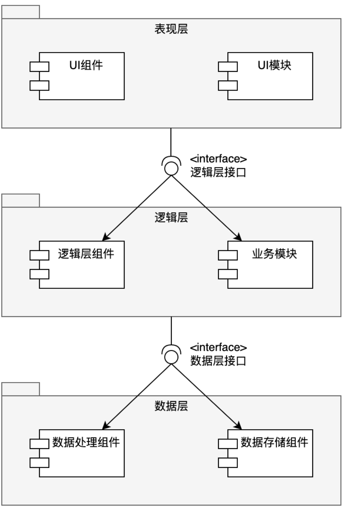
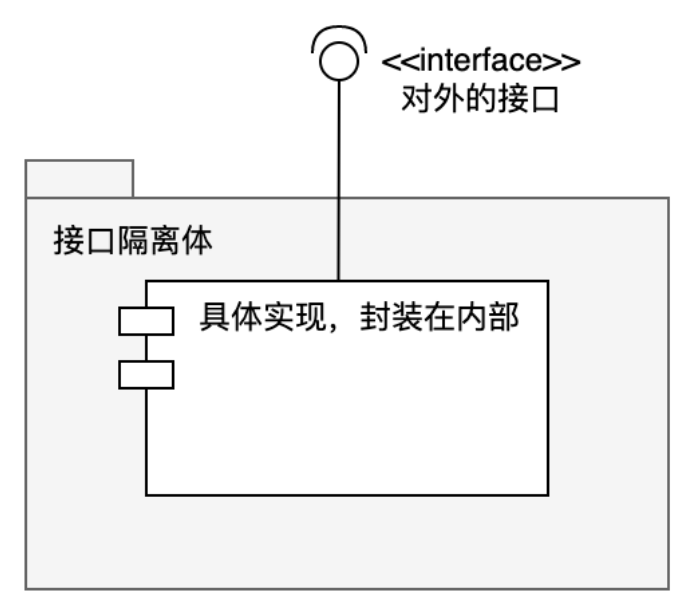
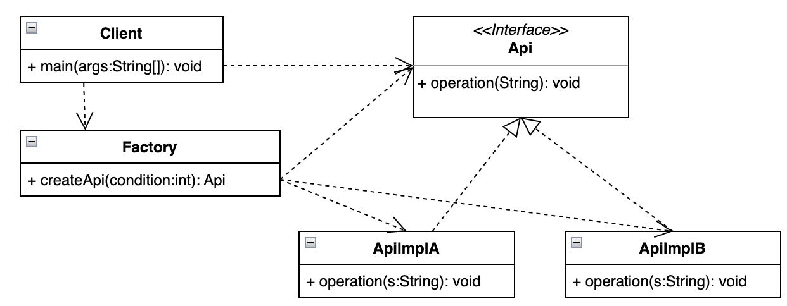
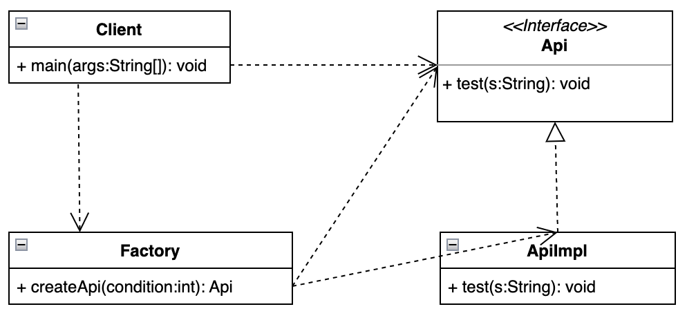

# 1 引言

## 1.1 接口回顾

接口是Java的一种特殊抽象类，和一般的抽象类相比，接口里面所有的方法都是抽象方法，接口里面的所有属性都是常量。接口里面只有方法定义而不会有任何的方法实现。

<!-- more -->
<!-- markdownlint-disable MD041 MD002--> 

### 1.1.2 接口使用场景

接口用来定义实现类的外观，约束实现类的行为。相当于一分契约，根据调用方需要的功能，约定了实现类需要实现的方法。但具体的实现类除了实现接口约定的功能外，还可以实现一些以其他的功能，也就是说实现类的功能包含但不仅限于接口约束的功能。

通过使用接口，可以实现不相关类的相同行为，而不需要考虑这些类之间的层次关系，接口就是实现类对外的外观。

### 1.1.3 接口的思想

**封装隔离**

封装：对被隔离体的行为或者指责的封装；
隔离：对内部实现和外部调用的隔离；

外部调用只能通过接口进行调用，而外部调用是不知道内部具体实现的，也就是说**外部调用和内部实现是被接口隔离开的**。

### 1.1.4 接口的好处

由于外部调用和内部实现被接口隔离开了，**只要接口不变，内部实现的变化就不会影响到外部应用**，从而使得系统更灵活，具有更好的扩展性和可维护性，即**“接口是系统可插拔性的保证”**

### 1.1.5 接口和抽象类的选择

接口是特殊的抽象类，日常开发使用中，**优先使用接口**。**如既要定义子类行为，又要为子类提供公用的功能时，使用抽象类。**

## 1. 2 面向接口编程

在Java项目程序设计中，一般会将整体架构分为不同的层级和模块，一般为三层，分别为表现层（UI层、视图层、界面层）、业务逻辑层（biz层、service层）、数据层（持久层），层级之间通过接口调用来通讯。

在每层中，又分为很多模块，每个模块对外也是一个整体，对外也是提供接口服务，其他地方需要用到此模块功能时，只需要进行接口调用就行了。即：**“接口是被其隔离部分的外观”**。



在同一层内部各个模块的交互也是通过接口调用进行。


其中，所谓组件，**就是能完成一定功能的封装体**。小到一个类，大到一个系统，都可以称之为组件，一个大的系统是由多个小系统组成。事实上，从设计的角度看，系统、子系统、模块、组件等说的其实是同一回事情，都是完成一定功能的封装体，只不过功能多少不同而已。

延续刚才的思路，无论是业务层、业务模块或者一个组件，都是一个被接口隔离的整体，即，接口的隔离体。



接下来，讨论一个问题，**如何在程序中使用接口，做到面向接口编程？**

## 1. 3 非设计模式的方案

例子：假设有个接口`Api`，实现类`ApiImpl`，客户端如何使用？

一般使用方法是，在客户端创建一个`Impl`的实例，然后将其赋值给`Api`的接口变量，然后客户端可以通过使用这个变量来操作接口的功能。


代码示例：

1 定义接口Api

```java
/**
 * @Auther mark
 * @Version Api.java v1.0 2022/9/28 23:44 Exp $
 * @Description 某个接口(通用的 、 抽象的 、 非具体的功能)
 */
public interface Api {
    /**
     * 某个具体的功能方法的定义，用test来演示一下。
     * 这里的功能很简单，把传入的s打印输出即可
     *
     * @param s 任意想要打印输出的字符串
     */
    public void test(String s);
}
```

2 实现类

```java
/**
 * @Auther mark
 * @Version ApiImpl.java v1.0 2022/9/28 23:47 Exp $
 * @Description
 */
public class ApiImpl implements Api {
    /**
     * 对接口的实现
     *
     * @param s 任意想要打印输出的字符串
     */
    @Override
    public void test(String s) {
        System.out.println("Now In Impl. The input s==" + s);
    }
}
```

3 客户端，接口不能直接使用，需要使用接口的实现类

```java
/**
 * @Auther mark
 * @Version Client.java v1.0 2022/9/28 23:49 Exp $
 * @Description 客户端：测试使用Api接口
 */
public class Client {
    public static void main(String[] args) {
        Api api = new ApiImpl();
        api.test("This is test!");
    }
}
```

## 1.4 存在的问题

``` java
 Api api = new ApiImpl();
```

从客户端对接口能力的使用来看，**客户端不但知道了接口，同时还知道了具体的实现就是ApiImpl。而接口的思想是“封装隔离”，而ApiImpl这个实现类，应该是被接口Api封装并同客户端隔离开的**，也就是说，**客户端根本就不应该知道具体的实现类是Impl**。

从封装隔离的角度看，如果将客户端中对接口的实现类去除的话，如何使用接口能力？

> 以上问题还可以描述为：
>
> 在Java编程中，出现只知接口而不知实现，该怎么办？
> 就像现在的Client，它知道要使用Api接口，但是不知由谁实现，也不知道如何实现，从而得不到接口对象，就无法使用接口，该怎么办呢？

# 2 简单工厂模式

## 2.1 定义

简单工厂模式（Simple Factory Pattern）又称为静态工厂方法（Static Factory Pattern）属于类创建型模式。提供一个创建对象实例的能力，无需关心其内部具体实现。被创建的实例的类型可以是接口、抽象类，也可以是具体的类。

## 2.2 简单工厂模式解决问题思路

解决[上述问题](#存在的问题)的一个简单方法就是使用简单工厂模式。

上面问题描述中，封装隔离的原则是不能让模块外部知道模块内部的具体实现，但是在模块内部可以知道这些信息，并且创建接口是需要知道具体的实现类。

按照这个思路，可以在模块内部**新建一个类**，在这个类中创建接口，通过这个新建类的方法来创建接口并且返回给客户端。通过这种方式，外部应用只需要根据这个类可以获取相应的接口对象，获得接口能力。这个**新建类**的对象就是简单工厂（Factory）。

通过这个方法，客户端只需要和Factory对接，然后创建接口，使用模块内提供的能力，而无需关心内部模块的具体实现逻辑。

## 2.3 结构说明



> `Api`: ：定义客户所需要的功能接口
> `Impl`: 具体实现Api的实现类，可能会有多个
> `Factory`: 工厂，选择合适的实现类来创建Api接口对象
> `Client`: 客户端，通过Factory去获取Api接口对象，然后面向Api接口编程

## 2.4 代码示例

<u>Api.java</u>

```java
/**
 * @Auther mark
 * @Version Api.java v1.0 2022/10/1 00:12 Exp $
 * @Description 接口的定义，该接口可以通过简单工厂来创建
 */
public interface Api {
    /**
     * 示意，具体的功能方法的定义
     *
     * @param s 示意，需要的参数
     */
    public void operation(String s);
}

```

<u>ApiImplA.java</u>

```java
/**
 * @Auther mark
 * @Version ApiImplA.java v1.0 2022/10/1 00:14 Exp $
 * @Description 接口的具体实现对象A
 */
public class ApiImplA implements Api {
    /**
     * 实现功能的代码，示意一下
     *
     * @param s 示意，需要的参数
     */
    @Override
    public void operation(String s) {
        System.out.println("ImplA s==" + s);
    }
}
```

<u>ApiImplB.java</u>

```java
/**
 * @Auther mark
 * @Version ApiImplB.java v1.0 2022/10/1 00:14 Exp $
 * @Description 接口的具体实现对象B
 */
public class ApiImplB implements Api {
    /**
     * 实现功能的代码，示意一下
     *
     * @param s 示意，需要的参数
     */
    @Override
    public void operation(String s) {
        System.out.println("ImplB s==" + s);
    }
}
```

<u>Factory.java</u>

```java
/**
 * @Auther mark
 * @Version Factory.java v1.0 2022/10/1 00:16 Exp $
 * @Description 工厂类，用来创造Api对象
 */
public class Factory {
    /**
     * 具体的创造Api对象的方法
     *
     * @param condition 示意，从外部传入的选择条件
     * @return 创造好的Api对象
     */
    public static Api createApi(int condition) {
        //应该根据某些条件去选择究竟创建哪一个具体的实现对象，
        //这些条件可以从外部传入，也可以从其它途径获取。
        //如果只有一个实现，可以省略条件，因为没有选择的必要。

        //示意使用条件
        Api api = null;
        if (condition == 1) {
            api = new ApiImplA();
        } else if (condition == 2) {
            api = new ApiImplB();
        }
        return api;
    }
}
```

<u>Client.java</u>

```java
/**
 * @Auther mark
 * @Version Client.java v1.0 2022/10/1 00:19 Exp $
 * @Description 客户端，使用Api接口
 */
public class Client {
    public static void main(String[] args) {
        //通过简单工厂来获取接口对象
        Api api = Factory.createApi(1);
        api.operation("正在使用简单工厂");
    }
}
```

## 2.5 重写方案

使用简单工厂模式重写前面提到的[方案](#非设计模式的方案)，主要是创建一个简单工厂对象，让简单工厂来负责创建接口对象，然后通过客户端来获取接口对象，而不用由客户端再去创建接口对象。



1 定义接口 + 实现类 与前面 例子一致，参见[详情](#非设计模式的方案)

2 创建简单工厂类

```java
/**
 * @Auther mark
 * @Version Factory.java v1.0 2022/10/1 00:31 Exp $
 * @Description 工厂类，用来创造Api对象
 */
public class Factory {
    /**
     * 具体的创造Api对象的方法
     *
     * @return 创造好的Api对象
     */
    public static Api createApi() {
        //由于只有一个实现，就不用条件判断了
        return new ApiImpl();
    }
}
```

3 客户端使用工厂类，不需要再自己去创建接口类对象

```java
/**
 * @Auther mark
 * @Version Client.java v1.0 2022/9/28 23:49 Exp $
 * @Description 客户端：测试使用Api接口
 */
public class Client {
    public static void main(String[] args) {
        //Api api = new ApiImpl();
        //api.test("This is test!");

        Api api = Factory.createApi();
        api.test("This is test!");
    }
}
```

客户端通过简单工厂创建了一个实现接口的对象，然后面向接口编程，**从客户端来看，它根本就不知道具体的实现是什么，也不知道是如何实现的，它只知道通过工厂获得了一个接口对象，然后就能通过这个接口来获取想要的功能**。

其实简单工厂在实际工作当中使用的比较少，而是帮助我们理解面向接口编程，只用到了接口多态的特性，并没有体现出“封装隔离”。

# 3 进一步理解

**接口是用来封装隔离具体的实现的，目标就是不要让客户端知道封装体内部的具体实现**。简单工厂的位置是位于封装体内，也就是**简单工厂是跟接口和具体的实现在一起的，算是封装体内部的一个类，所以简单工厂知道具体的实现类是没有关系的**。

对于客户端而言，只需要了解接口Api和简单工厂Factory，通过Factory就可以使用Api的能力，而无需了解具体实现。所以看似简单的把“new Impl()”从客户端里移动到了简单工厂里面，其实是有质的变化。

## 3.1 认识简单工厂

### 3.1.1 简单工厂的功能

通过前面的示例，简单工厂一般用来创建接口的实例。其实不仅如此，简单工厂还可以创建抽象类，具体的类的实例。

### 3.1.2 静态工厂

使用简单工厂时，一般不用创建工厂类的实例（没必要），而是将工厂类实现为一个工具类，直接使用静态方法调用接口。此时也将简单工厂称为静态工厂。

> 为避免客户端直接创建工厂类的实例，可以将构造方法手动改为私有化

### 3.1.3 简单工厂创建对象的范围

理论上，简单工厂可以创建任意对象，但在实际使用中，建议创建对象的范围不要太大，建议创建的对象为一个独立的组件或者一个独立的模块，即，一个组件或者一个模块对应一个工厂。避免工厂类的职责不明，大杂烩。

### 3.1.4 简单工厂的命名建议

**<u>工厂类名建议：</u>**

> “模块名称 + Factory”，如：用户模块的工厂称为 -> UserFacotry

**<u>方法名建议：</u>**

> “get + 接口名称 或者 ”，如：接口名称为UserApi -> getUserApi 或 createUserApi
>
> 不建议命名 “new + 接口名称” ，其中new在java中为关键词，通过工厂来获取对象实例，不一定每次都需要创建，如果使用new，容易造成误解

## 3.2 简单工厂中方法的写法

从客户端的角度来看，接口能力的实例是通过工厂类创建的，但真正实现接口功能的是具体的实现类，并且这些实现类是已经实现好，并不是通过工厂类实现的。简单工厂的方法其实是：**实现了选择一个合适的实现类来使用**。

所以工厂方法中实现的是“如何选择合适的实现类”，大概有以下几种思路：

> - 由客户端client传入参数
> - 配置文件配置参数，由配置文件获取判断的值
> - 来源于缓存等运行期的值

如客户端传入参数的例子

1 接口定义

```java
public interface Api {
    /**
     * 示意，具体的功能方法的定义
     *
     * @param s 示意，需要的参数
     */
    public void operation(String s);
}
```

2 接口的两种实现

```java
public class ApiImplA implements Api {
    /**
     * 实现功能的代码，示意一下
     *
     * @param s 示意，需要的参数
     */
    @Override
    public void operation(String s) {
        System.out.println("ImplA s==" + s);
    }
}

public class ApiImplB implements Api {
    /**
     * 实现功能的代码，示意一下
     *
     * @param s 示意，需要的参数
     */
    @Override
    public void operation(String s) {
        System.out.println("ImplB s==" + s);
    }
}
```

3 工厂类的方法通过参数来判断具体创建哪个接口实现类

```java
public class Factory {
    /**
     * 具体的创造Api对象的方法
     *
     * @param condition 示意，从外部传入的选择条件
     * @return 创造好的Api对象
     */
    public static Api createApi(int condition) {
        //应该根据某些条件去选择究竟创建哪一个具体的实现对象，
        //这些条件可以从外部传入，也可以从其它途径获取。
        //如果只有一个实现，可以省略条件，因为没有选择的必要。

        //示意使用条件
        Api api = null;
        if (condition == 1) {
            api = new ApiImplA();
        } else if (condition == 2) {
            api = new ApiImplB();
        }
        return api;
    }
}
```

4 客户端根据需要传入对应的参数

```java
public class Client {
    public static void main(String[] args) {
        //通过简单工厂来获取接口对象
        Api api = Factory.createApi(1);
        api.operation("正在使用简单工厂");
    }
}
```

这种方法有个非常明显的缺点：由于是从客户端在调用工厂的时候，传入选择的参数，**这就说明客户端必须知道每个参数的含义，也需要理解每个参数对应的功能处理**。这就**要求必须在一定程度上，向客户暴露一定的内部实现细节**。

## 3.3 简单工厂的优缺点

**<u>优点：</u>**

> - 封装：简单工厂虽然很简单，但是非常有好地实现了组件的封装，**然后让组件外部能真正面向接口编程**。
> - 解耦：**通过简单工厂，实现了客户端和具体实现类的解耦**。如同上面的例子，客户端根本就不知道具体是由谁来实现，也不知道具体是如何实现的，客户端只是通过工厂获取它需要的接口对象。

**<u>缺点：</u>**

> - 增加复杂度：如果通过客户端的参数来选择具体的实现类，那么就必须让客户端能理解各个参数所代表的具体功能和含义，这会增加客户端使用的难度，也部分暴露了内部实现，这种情况可以选用可配置的方式来实现。
> - 不方便拓展：私有化简单工厂的构造方法，使用静态方法来创建接口，也就不能通过写简单工厂类的子类来改变创建接口的方法的行为。

## 3.4 思考

### 3.4.1 简单工厂的本质

简单工厂的本质是：选择实现

**注意简单工厂的重点在选择，实现是已经做好了的。**就算实现再简单，也要由具体的实现类来实现，而不是在简单工厂里面来实现。**简单工厂的目的在于为客户端来选择相应的实现，从而使得客户端和实现之间解耦**，这样一来，具体实现发生了变化，就不用变动客户端了，这个变化会被简单工厂吸收和屏蔽掉。

**实现简单工厂的难点就在于“如何选择”实现**，前面讲到了几种传递参数的方法，都属于静态的参数，还可实现成动态的参数。比如：在运行期间，由工厂去读取某个内存的值，或者是去读取数据库中的值，然后根据这个值来选择具体的实现等等。

### 3.4.2 使用场景

1. **如果想要完全封装隔离具体实现，让外部只能通过接口来操作封装体**，那么可以选用简单工厂，让客户端通过工厂来获取相应的接口，而无需关心具体实现；
2. **如果想要把对外创建对象的职责集中管理和控制**，可以选用简单工厂，一个简单工厂可以创建很多的、不相关的对象，可以把对外创建对象的职责集中到一个简单工厂来，从而实现集中管理和控制。

## 3.5 相关设计模式

### 3.5.1 简单工厂和抽象工厂

**简单工厂是用来选择实现的**，可以选择任意接口的实现，一个简单工厂可以有多个用于选择并创建对象的方法，多个方法创建的对象可以有关系也可以没有关系。

**抽象工厂模式是用来选择产品簇的实现的**，也就是说一般抽象工厂里面有多个用于选择并创建对象的方法，**但是这些方法所创建的对象之间通常是有关系的**，这些被创建的对象通常是构成一个产品簇所需要的部件对象。

所以从某种意义上来说，简单工厂和抽象工厂是类似的，**如果抽象工厂退化成为只有一个实现，不分层次，那么就相当于简单工厂了**。

### 3.5.2 简单工厂和工厂方法模式

简单工厂和工厂方法模式也是非常类似的。**工厂方法的本质也是用来选择实现的，跟简单工厂的区别在于工厂方法是把选择具体实现的功能延迟到子类去实现**。如果把工厂方法中选择的实现放到父类直接实现，那就等同于简单工厂。

### 3.5.3 简单工厂和创建型模式

**简单工厂的本质是选择实现**，所以它可以跟其它任何能够具体的创建对象实例的模式配合使用，比如：单例模式、原型模式、生成器模式等等。
